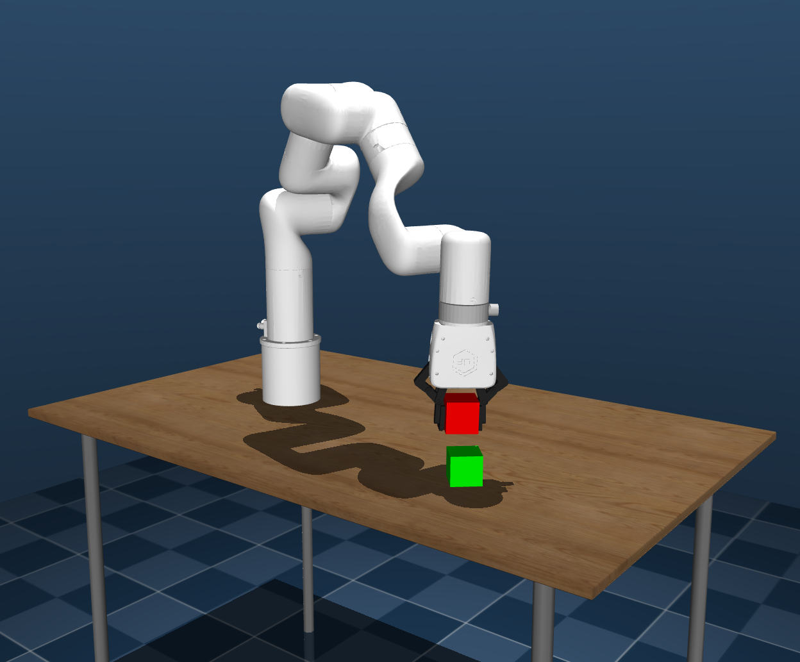
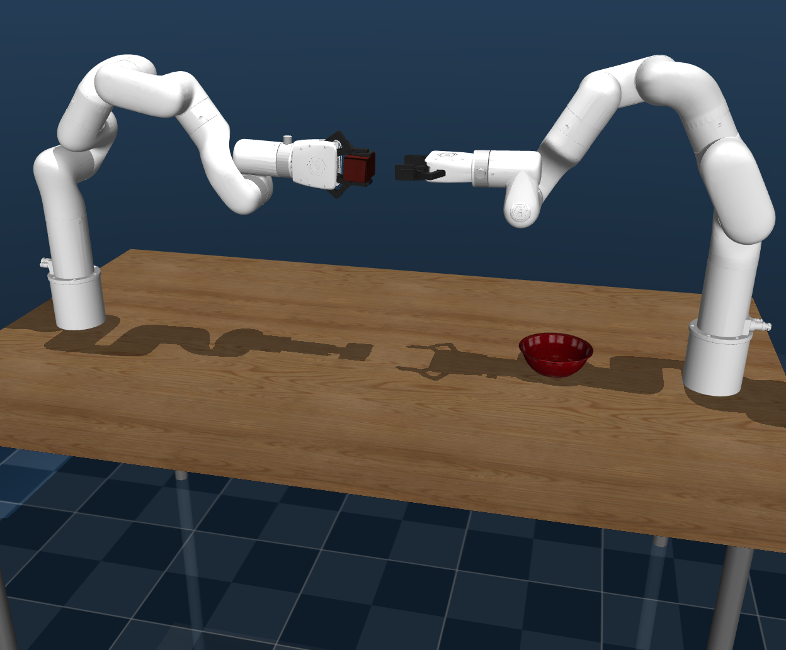
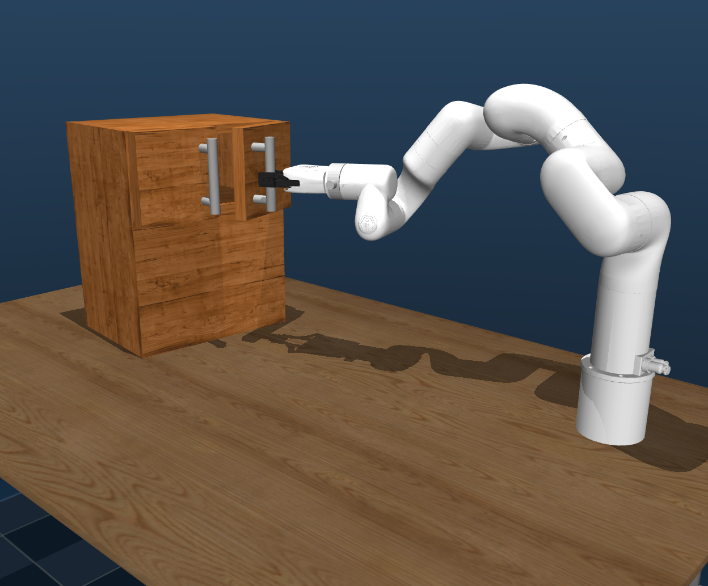

# Machenta Coding Project

## Overview

Open-loop robot arm agent in MuJoCo that performs 3 distinct manipulation tasks using privileged state information.

| Task 1 | Task 2 | Task 3 |
|:---:|:---:|:---:|
| Single arm picking a cube and stacking it on top of another cube. | Dual arms performing handover of "foam brick" into an "enamel-coated metal bowl". | Single arm opening a slightly open cabinet door. |
|  |  |  |

## Usage

This project uses [uv](https://github.com/astral-sh/uv) for fast Python environment management and package installation.

```sh
uv sync
uv venv

# For Linux
uv run -m tasks.cube_stacking
# For macOS
uv run mjpython -m tasks.cube_stacking
```

## Future Improvements

* Better configuration management
* Retry mechanism per primitive failure
* Parallel execution of primitives in a sequence
* Smarter domain randomization for objects given knowledge of arm reachability/workspace area
* Better motion planners
* Unit tests for planning/IK

## Developer Notes

To generate Python type stubs for MuJoCo (for autocompletion and type checking), run:

```sh
uv run pybind11-stubgen mujoco -o typings
```

This will create or update the `typings` directory with .pyi stub files for the MuJoCo Python bindings.
